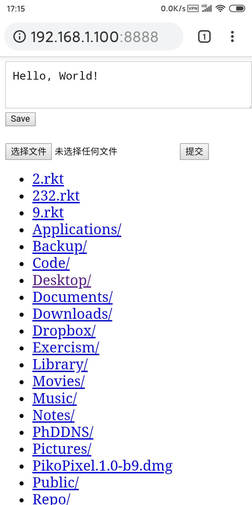

# Share text/file between your computer and phone

`tongbu.el` (同步) is an Emacs package which creates a web server for sharing
text and files between your computer and phone via a web browser.

## Usage

Use `M-x tongbu` to start the server, then goto http://0.0.0.0:8888.

- To share text, edit textarea and hit "Save" to update to the server
- To upload file, use the file input
- To download file, click the filename; click `..` to go to parent directory

Use `M-x list-processes` to stop the server, the process name looks like `ws-server`.

## Customization

### `tongbu-port` (defaults to 8888)

The server port. If you set it to 0, Emacs will pick a random port for you.

## Dependencies

- Emacs 25.1
- [emacs-web-server](https://github.com/eschulte/emacs-web-server)
